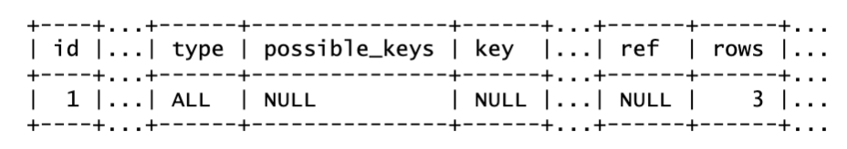
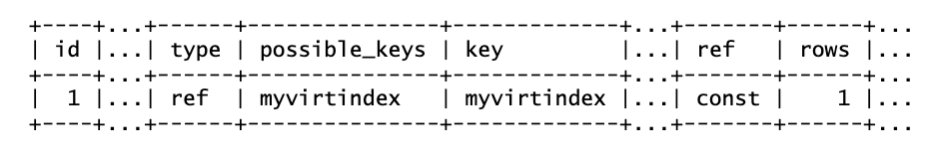

# Database Design

## Introduction
In this lab you will work with JSON datatype and MySQL Document Store.

Estimated Lab Time: 20 minutes

### Objectives
In this lab, you will:
* Work with SQL and JSON
* Understand the functioning of MySQL Document Store 
* Practice some CRUD operations.

> **Note:** 
  * Server: mysql1
  * Tasks 2 and 3 can be completed from app-srv


## Task 1: Work with JSON
1. Connect to your <span style="color:red">mysql-advanced</span> with admin user
    ```
    <span style="color:green">shell></span> <copy>mysqlsh -uadmin -p -h mysql1 -P 3307 --sql</copy>
    ```

2. Create a database for JSON tests
    ```
    <span style="color:blue">mysql></span> <copy>CREATE DATABASE json_test;</copy>
    ```
    ```
    <span style="color:blue">mysql></span> <copy>USE json_test;</copy>
    ```
3. Create a JSON table
    ```
    <span style="color:blue">mysql></span> <copy>CREATE TABLE jtest (id bigint NOT NULL AUTO_INCREMENT, doc JSON, PRIMARY KEY (id));</copy>
    ```
    ```
    <span style="color:blue">mysql></span> <copy>DESC jtest;</copy>
    ```
4. Add data to this table 

    > **Note:** The second insert adds 2 records in one step

    ```
    <span style="color:blue">mysql></span> <copy>INSERT INTO jtest(doc) VALUE('{"A": "hello", "b": "test", "c": {"hello": 1}}');</copy>
    ```
    ```
    <span style="color:blue">mysql></span> <copy>INSERT INTO jtest(doc) VALUE('{"b": "hello"}'),('{"c": "help"}');</copy>
    ```
    ```
    <span style="color:blue">mysql></span> <copy>SELECT * FROM jtest;</copy>
    ```
5. Retrieve json documents with these commands 

    > **Note** the shortcut “->” or “->>”


    ```
    <span style="color:blue">mysql></span> <copy>SELECT json_extract (doc, "$.b") FROM jtest;</copy>
    ```
    ```
    <span style="color:blue">mysql></span> <copy>SELECT doc->"$.b" FROM jtest;</copy>
    ```
    ```
    <span style="color:blue">mysql></span> <copy>SELECT doc->>"$.b" from jtest;</copy>
    ```

6.  Create an index on the virtual column
    * You can search a record and check with “explain” that there is no usable index on our table
        ```
        <span style="color:blue">mysql></span> <copy>select * from jtest where doc->>"$.b"='test';</copy>
        ```
        ```
        <span style="color:blue">mysql></span> <copy>EXPLAIN select * from jtest where doc->>"$.b"='test';</copy>
        ```
        
    * We add now an index on column “b”
        ```
        <span style="color:blue">mysql></span> <copy>alter table jtest add column gencol CHAR(50) AS (doc->>"$.b");</copy>
        ```
        ```
        <span style="color:blue">mysql></span> <copy>CREATE INDEX myvirtindex ON jtest(gencol);</copy>
        ```
    * And now we repeat the explain and see that now we automatically use the index
        ```
        <span style="color:blue">mysql></span> <copy>EXPLAIN select * from jtest where doc->>"$.b"='test';</copy>
        ```
        

7.  You can now exit from MySQL Shell
        ```
        <span style="color:blue">mysql></span> <copy>\q</copy>
        ```


## Task 2: MySQL Document Store
> **Note:** We use the port for Xdev (<span style="color:red">33070</span>) instead of usual classic protocol port (<span style="color:red">3307</span>)


1. Please connect to MySQL Database via X Protocol
    ```
    <span style="color:green">shell></span> <copy>mysqlsh -uadmin -hmysql1 -P 33070 -p</copy>
    ```
2. Create and use a test schema. 
    (We use javascript mode, but python is available also)

    ```
    <span style="color:blue">My</span><span style="color: orange">SQL </span><span style="background-color:yellow">JS</span>><copy>session.createSchema('docstore')</copy>
    ```
    ```
    <span style="color:blue">My</span><span style="color: orange">SQL </span><span style="background-color:yellow">JS</span>><copy>\use docstore</copy>
    ```
3. Now create and populate a small collection

    ```
    <span style="color:blue">My</span><span style="color: orange">SQL </span><span style="background-color:yellow">JS</span>><copy>db.createCollection('posts');</copy>
    ```

    ```
    <span style="color:blue">My</span><span style="color: orange">SQL </span><span style="background-color:yellow">JS</span>><copy>db.posts.add({"title":"MySQL 8.0 rocks", "text":"My first post!", "code": "42"})</copy>
    ```

    ```
    <span style="color:blue">My</span><span style="color: orange">SQL </span><span style="background-color:yellow">JS</span>><copy>db.posts.add({"title":"Polyglot database", "text":"Developing both SQL and NoSQL applications"})</copy>
    ```

4. Checking the built-in JSON validation
    ```
    <span style="color:blue">My</span><span style="color: orange">SQL </span><span style="background-color:yellow">JS</span>><copy>db.posts.add("This is not a valid JSON document")</copy>
    ```
5. Inspect the posts collection you have just created
    ```
    <span style="color:blue">My</span><span style="color: orange">SQL </span><span style="background-color:yellow">JS</span>><copy>db.posts.find()</copy>
    ```

    What can you notice? Did the system add something to content by itself?

    ```
    <span style="color:blue">My</span><span style="color: orange">SQL </span><span style="background-color:yellow">JS</span>><copy>db.posts.find().limit(1)</copy>
    ```

6. Modify existing elements of the collection
    ```
    <span style="color:blue">My</span><span style="color: orange">SQL </span><span style="background-color:yellow">JS</span>><copy>db.posts.modify("title = 'MySQL 8.0 rocks'").set("title", " MySQL 8.0 rocks!!!")</copy>
    ```
    ```
    <span style="color:blue">My</span><span style="color: orange">SQL </span><span style="background-color:yellow">JS</span>><copy>db.posts.find()</copy>
    ```
7. Check that that a collection is just a table with 2 columns: Index and JSON Document
    ```
    <span style="color:blue">My</span><span style="color: orange">SQL </span><span style="background-color:yellow">JS</span>><copy>session.sql("desc posts")</copy>
    ```
    ```
    <span style="color:blue">My</span><span style="color: orange">SQL </span><span style="background-color:yellow">JS</span>><copy>session.sql("show create table posts")</copy>
    ```
    ```
    <span style="color:blue">My</span><span style="color: orange">SQL </span><span style="background-color:yellow">JS</span>><copy>session.sql("select * from posts")</copy>
    ```
8. Therefore, it is possible to add indexes on specific JSON elements of the collection
    ```
    <span style="color:blue">My</span><span style="color: orange">SQL </span><span style="background-color:yellow">JS</span>><copy>db.posts.createIndex('myIndex', {fields: [{field:"$.title", type: "TEXT(20)"}]} )</copy>
    ```
    ```
    <span style="color:blue">My</span><span style="color: orange">SQL </span><span style="background-color:yellow">JS</span>><copy>session.sql("show create table posts")</copy>
    ```
13. Exit from client
    ```
    <span style="color:blue">mysql></span> <copy>\q</copy>
    ```

## Acknowledgements
* **Author** - Marco Carlessi, Principal Sales Consultant
* **Contributors** -  Perside Foster, MySQL Solution Engineering, Selena Sánchez, MySQL Solutions Engineer
* **Last Updated By/Date** - Selena Sánchez, MySQL Solution Engineering, May 2023
